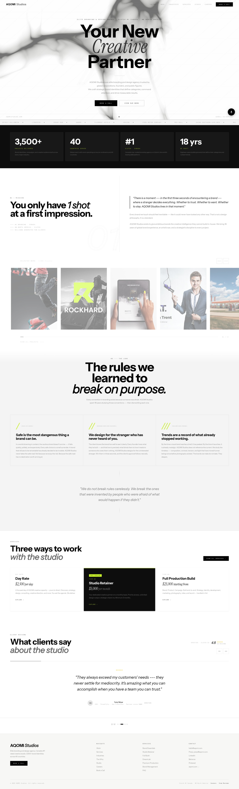
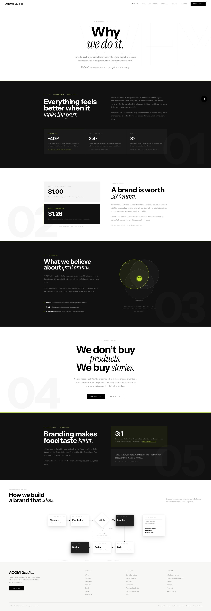
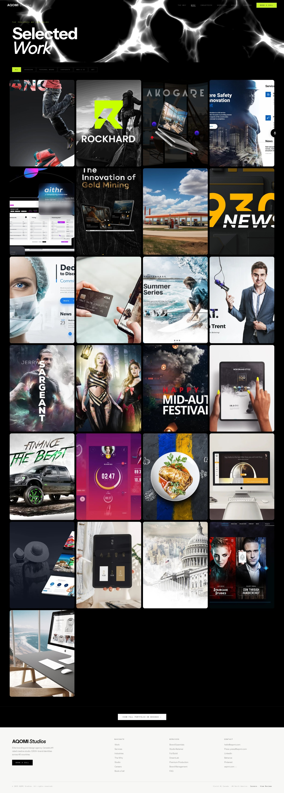
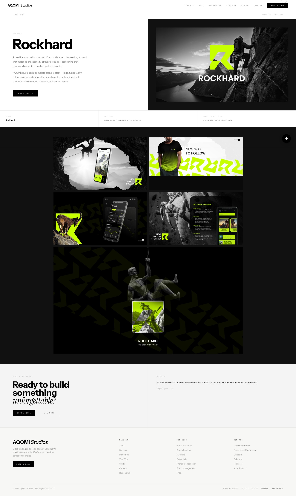
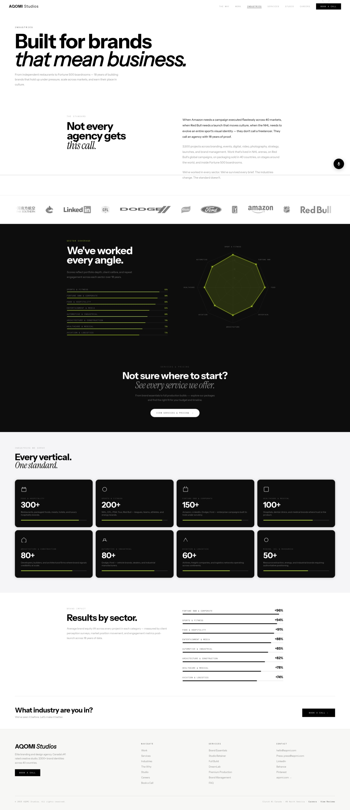
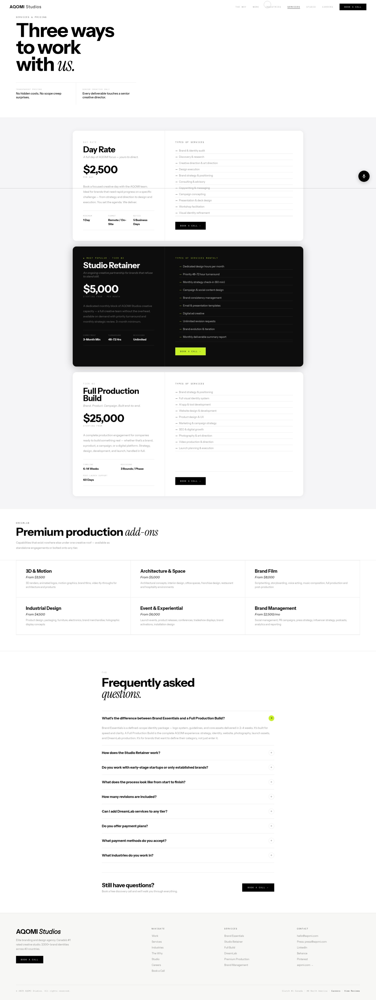
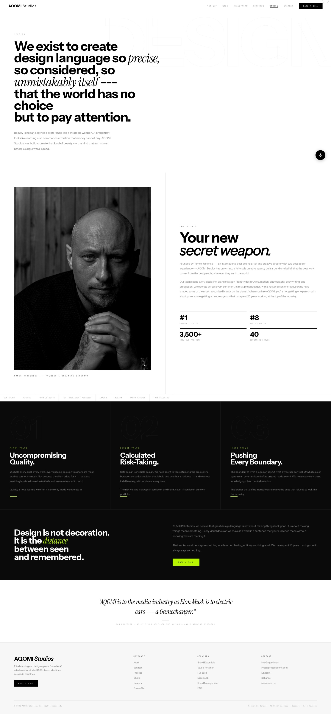
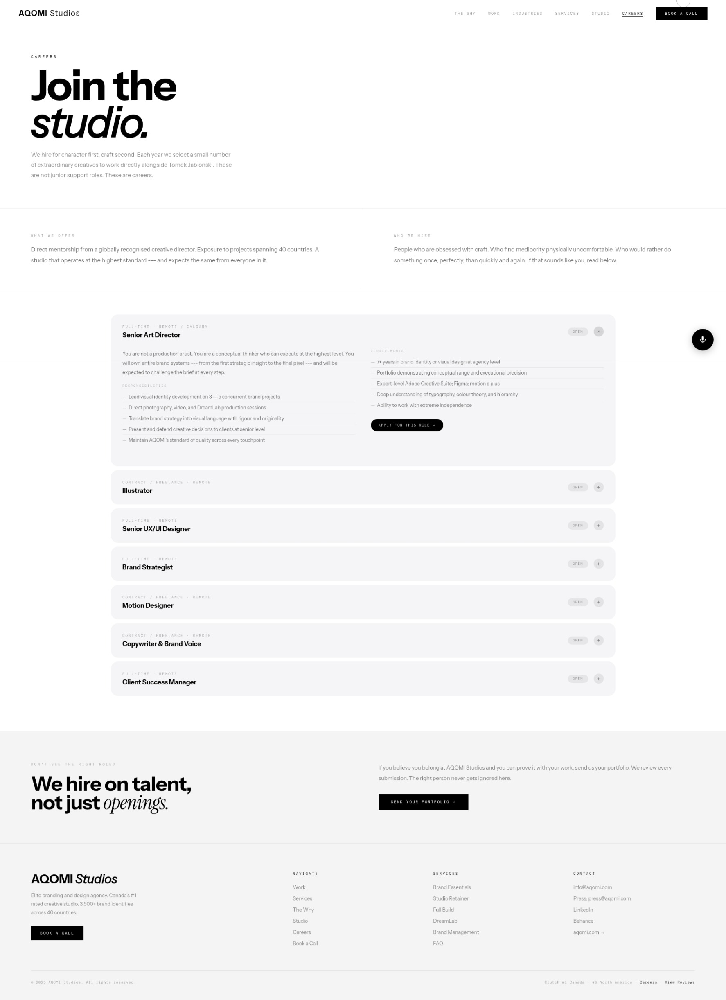

# AQOMI Studios



**AQOMI Studios** is an elite branding and design agency—Canada's #1 ranked creative studio and #8 in North America on Clutch. We build brands the world can't ignore. With over 3,500+ brand identities delivered across 40 countries, we treat every design constraint as a problem to solve rather than a limitation. We specialize in high-fidelity visual identities, immersive digital experiences, and brand strategy.

## 🚀 Technologies Used

This project is a high-performance Single Page Application (SPA) built without heavy frameworks to ensure maximum speed and control over every pixel and animation.

- **HTML5**: Highly semantic and modularized into decoupled partials for dynamic loading.
- **CSS3 (Vanilla)**: Employs a robust design system using CSS variables (tokens), modern layouts (Grid/Flexbox), smooth micro-animations, glassmorphism, and responsive design tailored for performance.
- **JavaScript (Vanilla ES6)**: Features a custom SPA router with lifecycle hooks (`onPageActivate`, `registerCleanup`), intersection observers for scroll reveals, dynamic partial injection via `pageLoader.js`, custom cursor logic, and WebGL-based mesh gradients.
- **Vite**: Ultra-fast build tool configured with `vite-plugin-compression` (Gzip and Brotli) for optimized production bundles.

## 📁 Project Structure

```text
├── public/
│   ├── images/
│   │   ├── git/                # Showcase images (Home, Work, etc.)
│   │   └── logos/              # High-fidelity SVG client logos
│   ├── partials/
│   │   ├── components/         # Reusable HTML components (nav, footer, etc.)
│   │   └── pages/              # HTML fragments for each SPA route
│   ├── robots.txt
│   └── sitemap.xml
├── src/
│   ├── css/
│   │   ├── animations.css      # Keyframes and transition logic
│   │   ├── components.css      # Specialized component styles
│   │   ├── layout.css          # Global grid and flex layouts
│   │   ├── responsive.css      # Media queries for mobile/tablet
│   │   ├── tokens.css          # Core CSS variables (colors, fonts)
│   │   └── pages.css           # Route-specific aesthetic refinements
│   └── js/
│       ├── main.js             # Main entry point and initialization
│       ├── pageLoader.js       # Dynamic DOM injection for partials
│       ├── router.js           # Custom SPA routing and lifecycle management
│       ├── meshGradient.js     # WebGL background rendering engine
│       ├── cursor.js           # Custom interactive cursor
│       ├── reveals.js          # Scroll-based intersection observers
│       └── ...                 # Additional feature modules (roadmap, carousel, etc.)
├── index.html                  # Main SPA shell
├── package.json                # Project metadata and dependencies
└── vite.config.js              # Vite build and compression configuration
```

## 📸 Showcase

### The Why


### Work


### Work Project Detail


### Industries


### Services


### Studio


### Careers


---

&copy; 2026 AQOMI Studios. All rights reserved.
